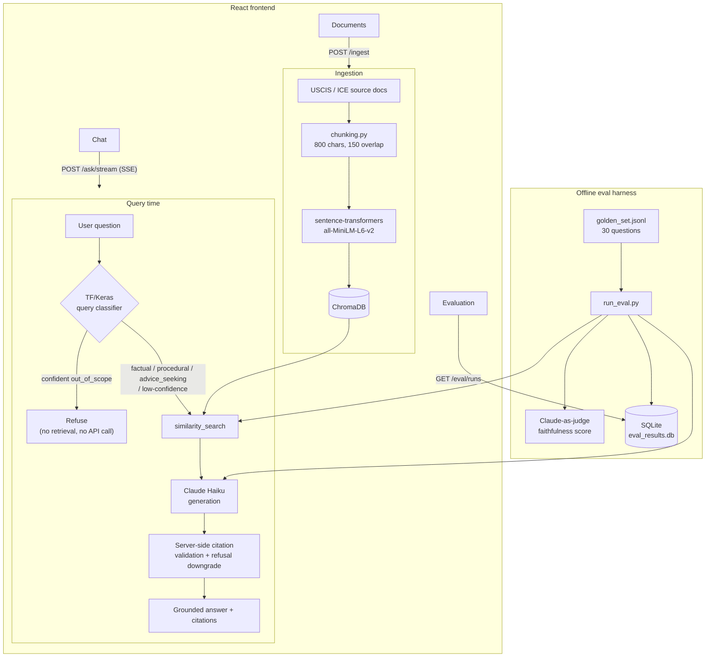

# Veritas

A question-answering system over official F-1 student immigration documents — OPT, STEM OPT, cap-gap, and the H-1B transition. Upload the government's own source documents, ask natural-language questions, and get answers grounded in those documents with inline citations pointing at the exact passages used. If the documents don't contain the answer, it refuses instead of guessing.

The differentiator isn't the chatbot — it's that answer quality is *measured*, not assumed. Every generated answer is validated server-side against the chunks actually retrieved before it's shown to anyone, and a golden-question eval harness scores retrieval, faithfulness, and classifier accuracy on every run so quality regressions are caught, not discovered.

## Why this domain

The project started domain-agnostic and was deliberately moved into F-1/OPT/STEM OPT/cap-gap immigration: the sources are public, government-authored documents (no copyright issues), the domain is one the author navigates personally, and — most importantly — a wrong answer here genuinely hurts someone's status. That makes the refusal behavior the hero feature, not a nice-to-have.

## Architecture



## Stack

| Layer | Choice | Why |
|---|---|---|
| Backend | FastAPI | Async, typed, thin |
| Retrieval | ChromaDB (native client) | LangChain only for loading/splitting; retrieval itself is a direct Chroma client — no unnecessary abstraction |
| Embeddings | `sentence-transformers` (`all-MiniLM-L6-v2`), local | Free, no API dependency for the retrieval half of the system |
| Generation | Claude Haiku via the Anthropic API | Fast, cheap, good instruction-following for a grounded-answer task |
| Query classifier | TensorFlow / Keras | Small text classifier, routes queries before retrieval |
| Frontend | React + TypeScript + Vite + Tailwind | Streaming chat, citations panel, eval dashboard |

## Quickstart

```bash
# backend needs Python 3.12 — see TESTING.md for why
cd backend
/opt/homebrew/bin/python3.12 -m venv .venv   # or your platform's Python 3.12
.venv/bin/pip install -r requirements.txt
echo "ANTHROPIC_API_KEY=sk-ant-..." > .env

cd ../frontend
npm install
```

Then, in two terminals:

```bash
cd backend && .venv/bin/python -m uvicorn app.main:app --port 8000
cd frontend && npm run dev
```

Open `http://localhost:5173`. Full verification steps (tests, lint, live routing checks, eval harness) are in **[TESTING.md](TESTING.md)**.

## Project structure

```
backend/
  app/
    ingestion/    # loaders, chunking, ChromaDB indexer
    classifier/   # TF/Keras query classifier: dataset, model, predictor
    rag/          # prompt, generator, streaming decoder, pipeline, routing
    eval/         # golden set, retrieval/faithfulness metrics, SQLite storage, runner
    main.py       # FastAPI routes
  scripts/        # CLI: ingest, train classifier, expand dataset, run eval
  tests/
frontend/
  src/
    api/          # typed fetch client
    hooks/        # useChatStream (SSE parsing + reconciliation)
    routes/       # Chat, Documents, Evaluation
    components/
data/
  corpus/         # source documents + manifest
  classifier/     # seed/expanded training data, trained model
  eval/           # golden_set.jsonl, eval_results.db (generated)
```

## Status

All 6 planned stages are complete: ingestion, generation with grounding, the query classifier (trained, 92.6% held-out accuracy), the evaluation harness (100% retrieval hit rate, 4.64/5 mean faithfulness on the golden set), the frontend, and this CI/docs stage. See **[docs/design-decisions.md](docs/design-decisions.md)** for the reasoning behind the non-obvious choices.
